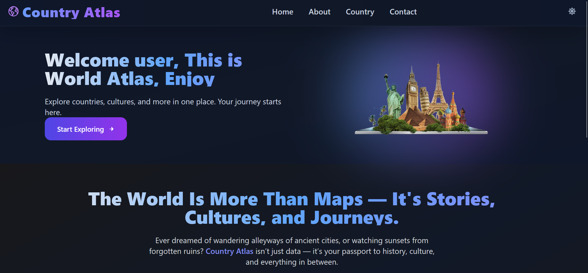

# 🌍 Country Atlas

**Country Atlas** is an immersive and visually rich React application that lets you explore every country in the world — through data, culture, and story. Whether you're a curious learner, a history buff, or an aspiring traveler, this app brings the world to your fingertips with elegance and depth.

---

## 📸 Preview

---

## ✨ Features

### 🔎 Explore Countries
- Browse countries from all over the globe
- See flags, names, regions, and more in beautifully designed cards
- Click **Read More** to view detailed data: capital, population, and more

### 🔍 Smart Search & Filters
- **Search** countries by name
- **Filter** by region (Asia, Africa, Europe, etc.)
- **Sort** countries in ascending/descending order

### 🌓 Full Dark Mode Support
- Elegant transitions and gradients
- Adaptive visuals for both light and dark environments

### 📱 Fully Responsive
- Seamless experience across phones, tablets, and desktops
- Layouts auto-adjust and animations scale well

### 🚀 Performance
- Fast load times using optimized API calls
- Reusable components with clean state management

---

## ⚙️ Tech Stack

- **Frontend:** React, React Router
- **Styling:** Tailwind CSS (Dark Mode + Responsive Design)
- **Icons:** React Icons
- **API:** [REST Countries API](https://restcountries.com)

---

## 🧠 Inspirations Behind Country Atlas

> _"Ever dreamed of wandering the alleyways of ancient cities, or watching sunsets from forgotten ruins? Country Atlas isn’t just data — it’s your passport to history, culture, and everything in between."_

This app is built not just for information, but **for inspiration**.

---

## 🧑‍💻 Author

Built with ❤️ by Asgar Rashid

> Data from REST Countries API.  
> © 2025 Country Atlas — All rights reserved.

---

## 🪄 Want to Contribute?

Contributions are welcome! Feel free to fork the repo, improve components, or add more cultural layers to the app.

\`\`\`bash

git clone https://github.com/rumi-13/Country-Atlas

cd country-atlas

npm install

npm run dev
\`\`\`

---

## 📝 License

This project is open source 

